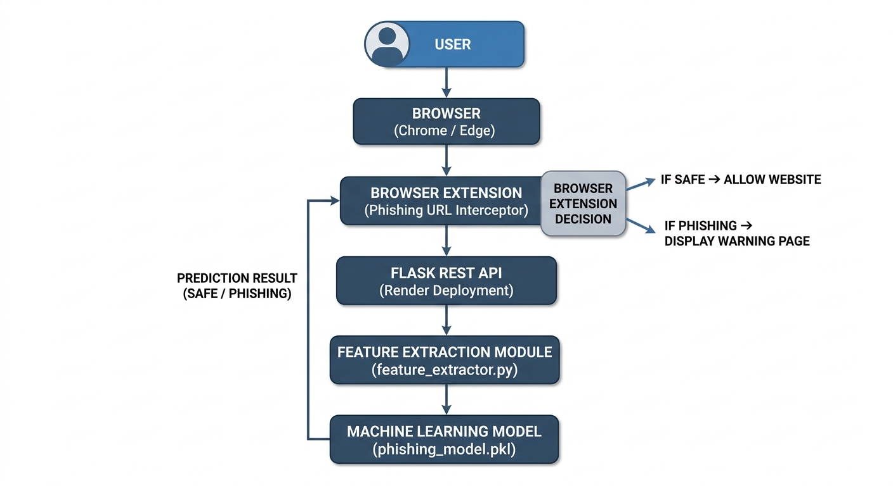

# 🛡️ Phishing URL Interceptor

> A Machine Learning powered browser extension that detects and blocks phishing websites in real time.


---

## 📌 Overview

Phishing URL Interceptor is a browser extension integrated with a Flask backend and a Machine Learning model to detect phishing websites in real time.

Whenever a user opens a webpage, the extension securely sends the URL to the backend API. The backend extracts phishing-related URL features and predicts whether the website is **SAFE** or **PHISHING** using a trained Machine Learning model.

If a phishing website is detected, the extension immediately blocks access and displays a security warning page, helping users avoid credential theft and online scams.

## ✨ Features

- 🔍 Real-time phishing URL detection
- 🌐 Browser extension for automatic website monitoring
- 🤖 Machine Learning based URL classification
- ⚡ Flask REST API for prediction
- 🛑 Automatic blocking of malicious websites
- 📊 Intelligent URL feature extraction
- 📈 Dynamic confidence score generation
- 🚦 Dynamic risk level classification (SAFE / LOW / MEDIUM / HIGH)
- 📝 AI-generated explanation for why a website was blocked
- 🎨 Modern security warning page with animated UI
- 🔒 Helps protect users from phishing attacks

## 🛠️ Tech Stack

### Frontend
- HTML
- CSS
- JavaScript
- Chrome Extension (Manifest V3)

### Backend
- Python
- Flask
- Flask-CORS

### Machine Learning
- Scikit-learn
- Joblib
- Pandas

### Deployment
- Render (Flask REST API)
- Microsoft Edge Extension


## 📂 Project Structure
```text
Phishing-URL-Interceptor
│
├── backend/
│   ├── app.py
│   ├── feature_extractor.py
│   ├── phishing_model.pkl
│   ├── requirements.txt
│   └── runtime.txt
│
├── extension/
│   ├── manifest.json
│   ├── background.js
│   ├── block.html
│   ├── block.js
│
├── screenshots/
├── docs/
├── architecture/
│
├── README.md
├── LICENSE
└── .gitignore
```

---

## 🏗️ System Architecture



## Extension Loaded in Chrome


## Legitimate Website


## Phishing Website


# 🔄 Working Flow

1. User visits a website.
2. The Chrome Extension intercepts the URL before the page fully loads.
3. The URL is securely sent to the Flask backend API.
4. The backend extracts phishing-related URL features.
5. The trained Random Forest model predicts whether the website is legitimate or phishing.
6. A confidence score and risk level are generated.
7. If the website is phishing:
   - The extension blocks the page.
   - A warning page is displayed.
   - The confidence score, risk level, and reasons for blocking are shown.
  
---

# 🧠 Machine Learning Features

The prediction model analyzes several URL characteristics, including:

- URL Length
- Host Length
- Number of Dots
- HTTPS Usage
- Presence of '@' Symbol
- Suspicious Top-Level Domains
- Hyphens in Domain
- Numeric Domain Names
- Phishing-related Keywords
- Number of Digits
- Uppercase Characters
- Subdomain Depth

---

# 📊 Example Prediction

Prediction

```text
PHISHING
```

Confidence

```text
97.33%
```

Risk Level

```text
HIGH
```

Reasons

- Website uses HTTP instead of HTTPS.
- URL contains phishing-related keywords.
- Domain contains hyphens.
---

# 🚀 Future Enhancements

- Google Safe Browsing API integration
- WHOIS lookup
- SSL Certificate validation
- VirusTotal integration
- Domain reputation analysis
- Deep Learning based phishing detection
- Support for Firefox and Microsoft Edge

---

# 👩‍💻 Author

**Sravyasree Gedela**

B.Tech Computer Science and Engineering

AI & Machine Learning Enthusiast

GitHub: https://github.com/Sravyasree-080905
